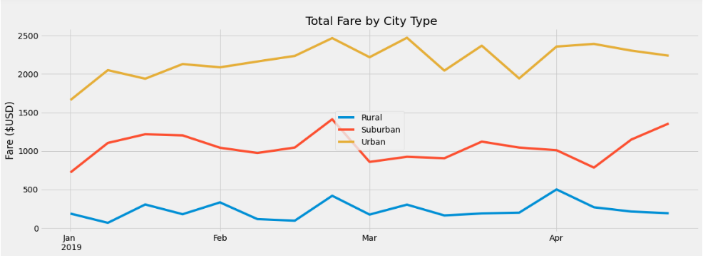

# PyBer_Analysis

## Project Overview
The purpose of this analysis is to help a ride-sharing corporation *PyBer* improve access to ride-sharing services for its customers, as well as to determine affordability for currently under-served neighborhoods. This was accomplished by writing Python scripts using pandas libraries, jupyter notebook, and mathplotlib to create a variety of charts. These charts showcase the relationship between the type of city (urban, suburban, and rural) and the number of drivers and riders. Additionally, we were able to produce visuals to depict total fares, total drivers, and total riders by each type of city, as well as average fares per rider and average fares per driver, in each of the three aforementioned city types.

## Resources
- Data Sources: city_data.csv, ride_data.csv
- Software: Python 3.8.8, Jupyter Notebook : 6.3.0, Visual Studio Code, 1.60.2

## Results
I produced a DataFrame which displays the sum of fares, updating every time a new ride occurs. You can see it below. The top row displays the city types. The first column lists the exact date-and-time of the year we're pinpointing. The columns underneath the headers designating each city type display the total value, in USD, that was produced in revenue on that ride via PyBer fares. This table specifically hones in on data between January 1st, 2019, through April 29th, 2019.

Since this chart updates for every single ride taken, it is not really helpful for seeing long-term trends. As such, I used the resample() function on the DataFrame above to produce the same data, binned into weeks. Now, we are able to see the data in terms of a weekly basis, as opposed to ride by ride, minute by minute. This lets us see "the bigger picture," through weekly trend patterns.

Among the three different city types (urban, suburban, and rural), we can see some stark differences:
- Urban city riders produce the highest fares compared to suburban and rural riders.
- Rural city riders have produced the least fares, historically.
- Suburban city riders consistently constitute fare revenue at rates between those from riders in urban cities and rural cities.
- There appears to be an uptick in fares seen consistently, across all three city types, in late Feburary of 2019.
- It is apparent that the larger the market (i.e. urban cities), the larger the returns in fares. This makes sense: more demand while supply is held constant means more revenue.
- Rural riders consistenly produce revenue from fares. When looking at weekly sums, no week ever returned $0. There is always some business revenue coming in from rural cities, albeit sometimes very little does come in on certain weeks. 

Finally, here is a graph of the data in the DataFrame seen above. 

## Summary
After sifting through this data and producing visuals of patterns within, I am able to offer a few ideas to the PyBer executive board.
- Rural fare revenues are much lower than those collected from urban and suburban rides. To produce more business, I postulate that reduced fare rates for rural riders could ultimately draw in a larger PyBer-using demographic, in these rural regions. In the long run, this could produce greater fare returns from the rural cities market.
- In the same vein of thinking above, in raising urban city fare rates, more revenue could be realized by PyBer. Since the market for ride-sharing is so dense in urban areas (with so many riders), it is virtually guaranteed that riders will always need rides. If ride fares increased, some riders might forego PyBer, but the increase in returns from remaining riders could be substantial - we could see a 100%+ increase in fare revenue in the future!
- Fares historically bumped in late February. This can be concluded that more clients need more rides around this time of the year. Based on these trends, we could bump up fare rates for riders around this time every year, since we see that the demand consistently increased for rides at this time, in all three city types. In calculatedly rising prices when, demand increases historically, we could increase revenue with such an opportunity.